= AutoCoconut - workflow report

. Click with the *left* button at coordinates *(447, 195)*. See the screenshot for the aproximate
area of the click. 
+
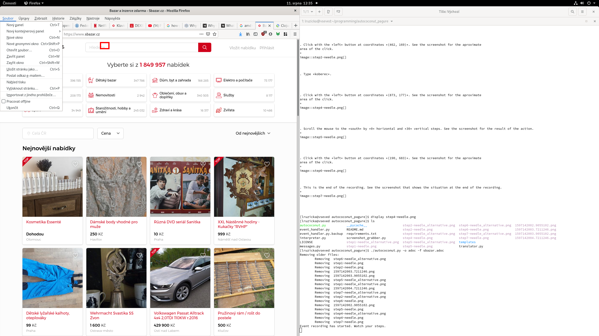

. Click with the *left* button at coordinates *(455, 181)*. See the screenshot for the aproximate
area of the click. 
+
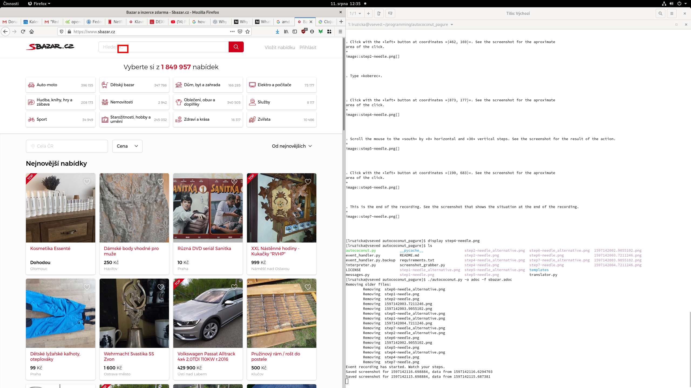

. Type *audi a4*.

. Press *down*. See the screenshot for the result of the action. 
+

. Press *down*. See the screenshot for the result of the action. 
+
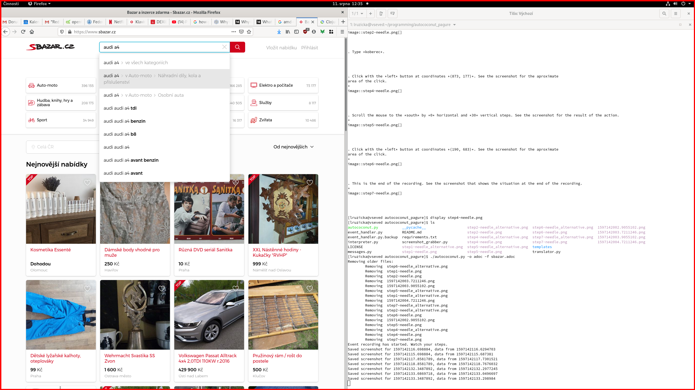

. Press *down*. See the screenshot for the result of the action. 
+
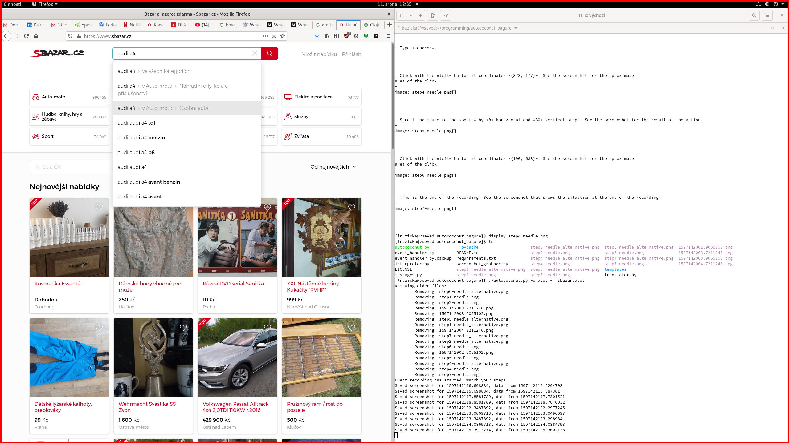

. Press *enter*. See the screenshot for the result of the action. 
+
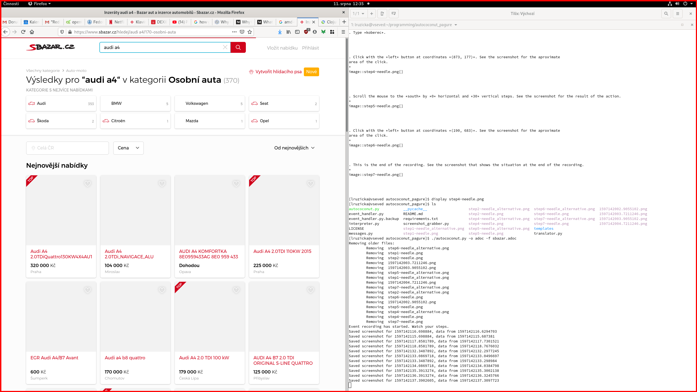

. Click with the *left* button at coordinates *(477, 938)*. See the screenshot for the aproximate
area of the click. 
+
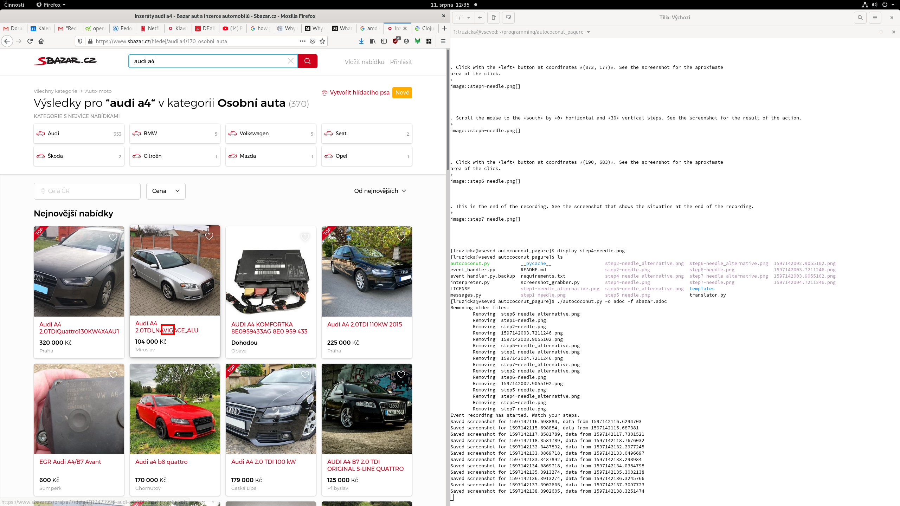

. Click with the *left* button at coordinates *(780, 613)*. See the screenshot for the aproximate
area of the click. 
+
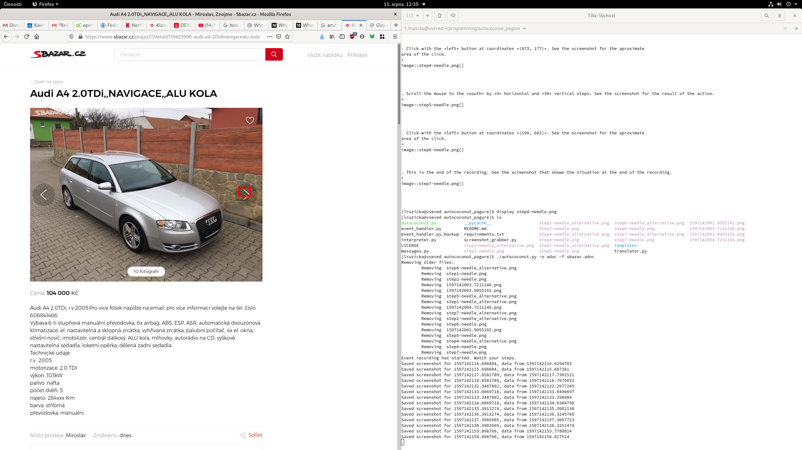

. Click with the *left* button at coordinates *(779, 613)*. See the screenshot for the aproximate
area of the click. 
+
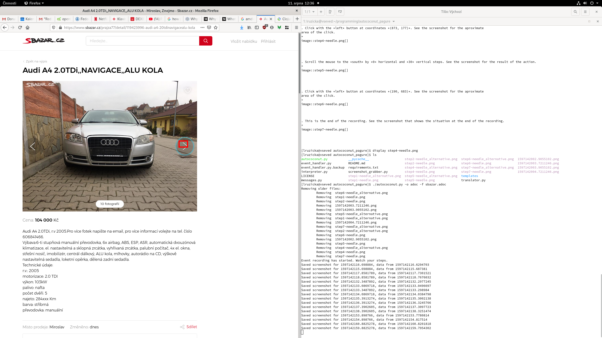

. Click with the *left* button at coordinates *(779, 613)*. See the screenshot for the aproximate
area of the click. 
+
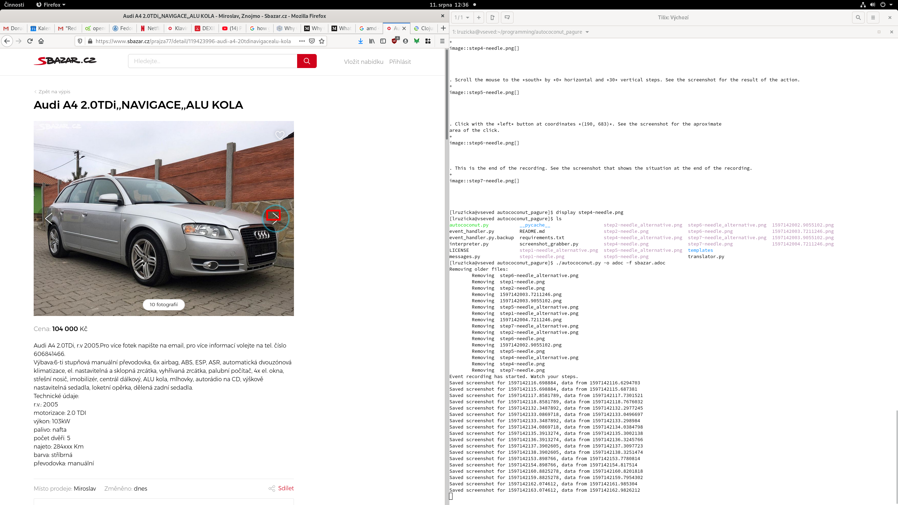

. Click with the *left* button at coordinates *(779, 613)*. See the screenshot for the aproximate
area of the click. 
+
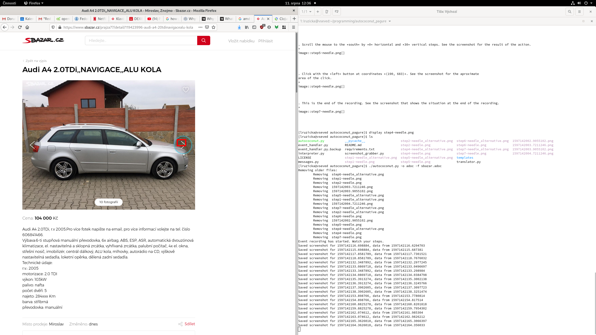

. Click with the *left* button at coordinates *(779, 613)*. See the screenshot for the aproximate
area of the click. 
+
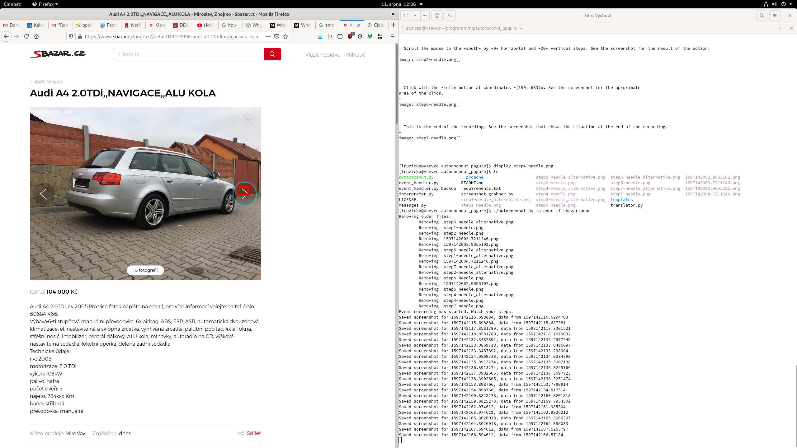

. Click with the *left* button at coordinates *(779, 613)*. See the screenshot for the aproximate
area of the click. 
+
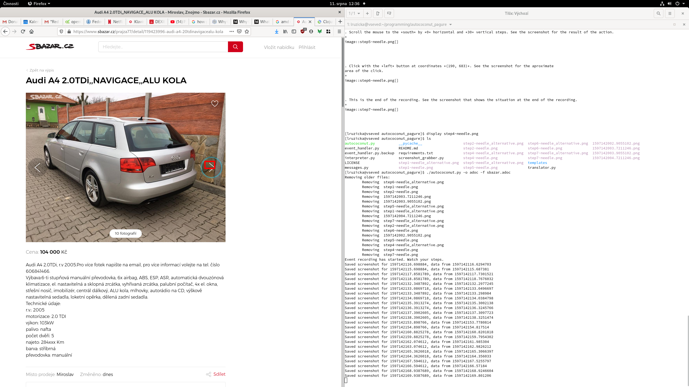

. Click with the *left* button at coordinates *(779, 613)*. See the screenshot for the aproximate
area of the click. 
+
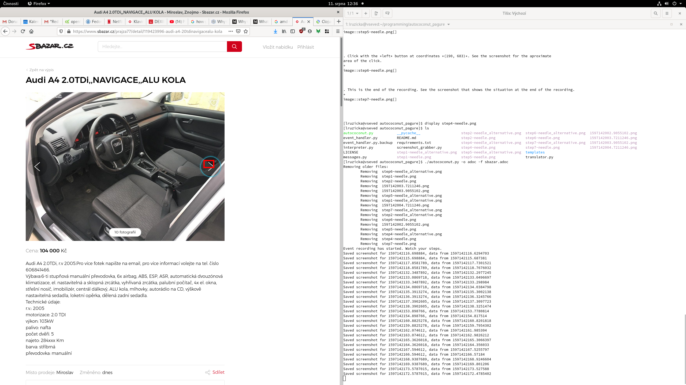

. Click with the *left* button at coordinates *(779, 613)*. See the screenshot for the aproximate
area of the click. 
+
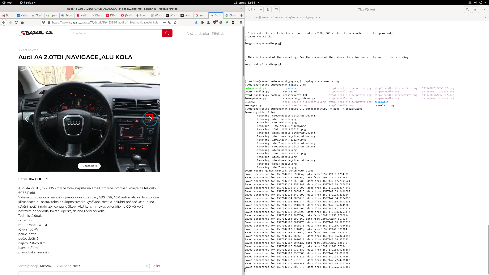

. Click with the *left* button at coordinates *(779, 613)*. See the screenshot for the aproximate
area of the click. 
+
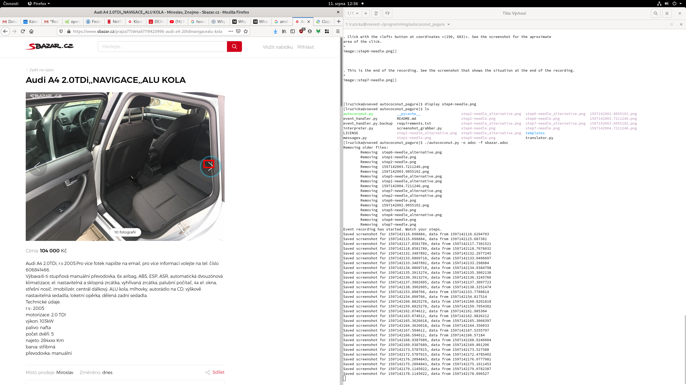

. This is the end of the recording. See the screenshot that shows the situation at the end of the recording. 
+
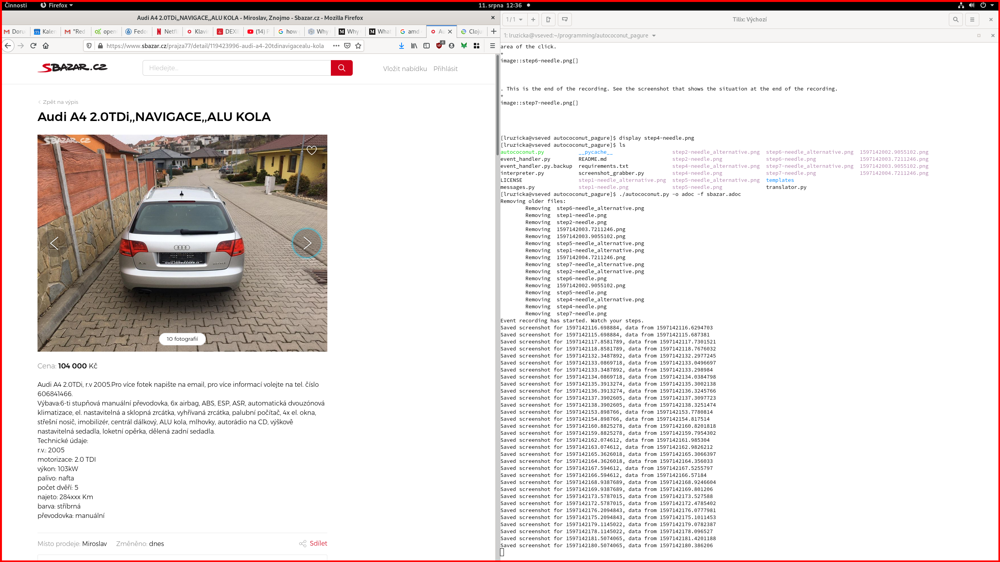

